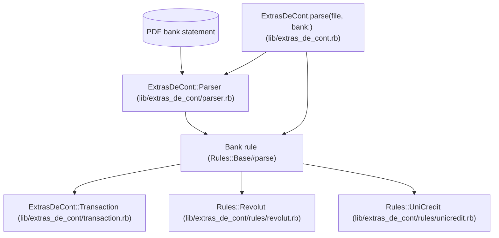
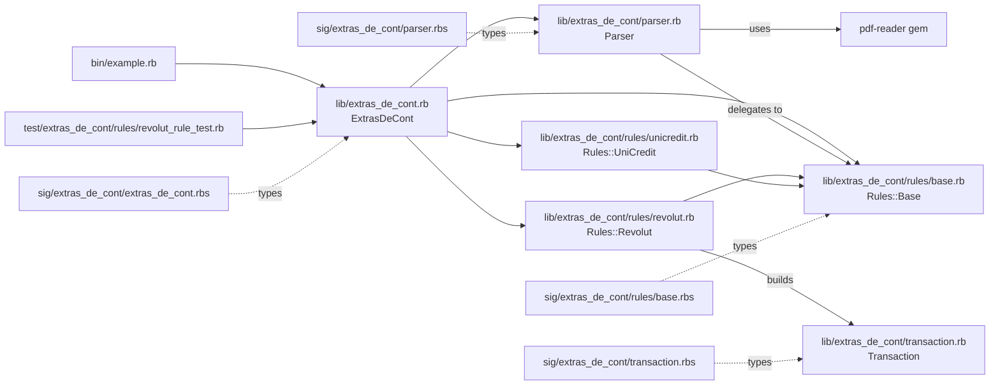

# Codebase diagrams

## High-level architecture (data flow)

```mermaid
flowchart TD
  PDF[(PDF bank statement)] --> Parser["ExtrasDeCont::Parser (lib/extras_de_cont/parser.rb)"]
  Parser --> Rule["Bank rule (Rules::Base#parse)"]
  Rule --> Txns["ExtrasDeCont::Transaction (lib/extras_de_cont/transaction.rb)"]

  Entry["ExtrasDeCont.parse(file, bank:) (lib/extras_de_cont.rb)"] --> Parser
  Entry --> Rule

  Rule --> Revolut["Rules::Revolut (lib/extras_de_cont/rules/revolut.rb)"]
  Rule --> UniCredit["Rules::UniCredit (lib/extras_de_cont/rules/unicredit.rb)"]
```

## Codebase map (dependencies)

```mermaid
graph LR
  A[lib/extras_de_cont.rb<br/>ExtrasDeCont] --> B[lib/extras_de_cont/parser.rb<br/>Parser]
  A --> C[lib/extras_de_cont/rules/base.rb<br/>Rules::Base]
  A --> D[lib/extras_de_cont/rules/revolut.rb<br/>Rules::Revolut]
  A --> E[lib/extras_de_cont/rules/unicredit.rb<br/>Rules::UniCredit]

  B -->|uses| F[pdf-reader gem]
  B -->|delegates to| C

  D -->|builds| G[lib/extras_de_cont/transaction.rb<br/>Transaction]
  D --> C
  E --> C

  H[bin/example.rb] --> A
  I[test/extras_de_cont/rules/revolut_rule_test.rb] --> A

  S1[sig/extras_de_cont/extras_de_cont.rbs] -.types.-> A
  S2[sig/extras_de_cont/parser.rbs] -.types.-> B
  S3[sig/extras_de_cont/rules/base.rbs] -.types.-> C
  S4[sig/extras_de_cont/transaction.rbs] -.types.-> G
```

